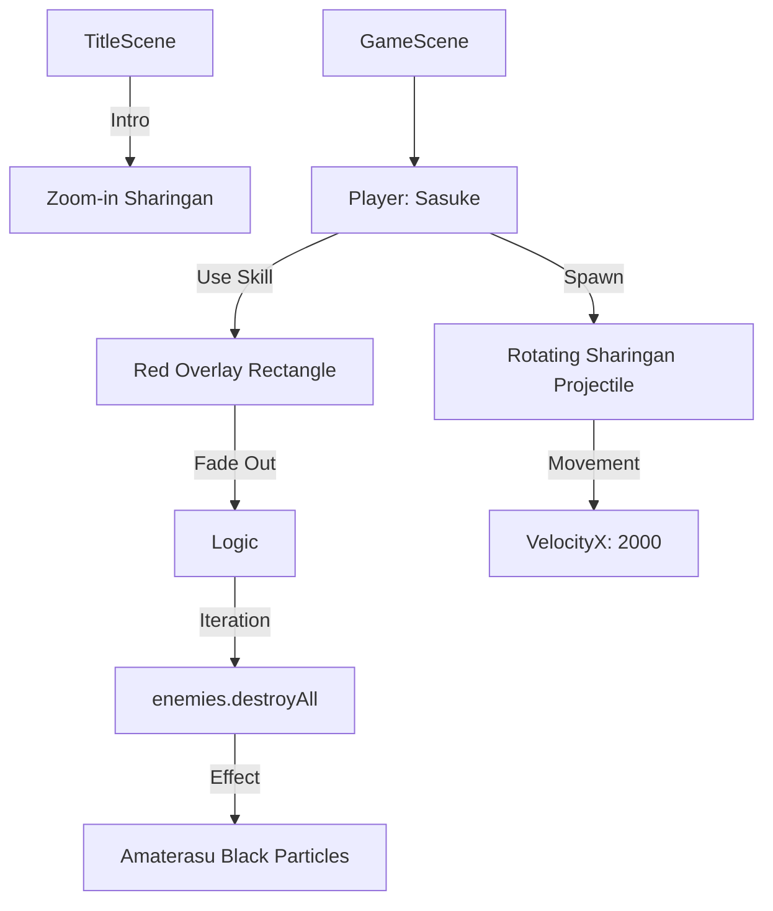

# Nh Ninja V9.3 (Uchiha's Awakening) 최종 시스템 구성도

## 1. 아키텍처 개요
- **엔진:** Phaser 3
- **자원 관리:** Procedural Pixel Rendering (24x24 Sharingan Matrix 추가).
- **시각 효과:** Screen Filter Subsystem + Tween Sequence Manager.

## 2. 주요 모듈 및 궁극기 로직

## 3. 물리 및 충돌 레이어
- **Sharingan Projectile:** 물리 엔진 기반 전방 돌진 (중력 무시).
- **Global Kill Zone:** 거리 기반 소멸 로직 (`Distance.Between`).

---
**시스템 구성도 업데이트 완료.**
